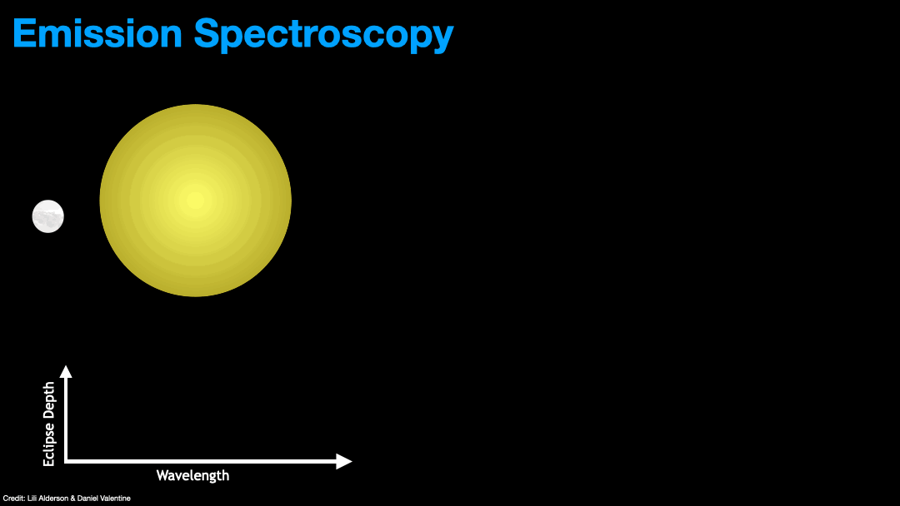



I work on characterising exoplanet atmospheres using the transit method. In particular, I use secondary eclipse observations, when a transiting exoplanet is eclipsed by its host star, to characterise the daysides of these exotic worlds. I do this using two primary methods:

**Emission Spectroscopy**

Transiting exoplanets on short orbits are tidally locked to their host stars, and therefore have a permanent dayside and nightside. Just prior to secondary eclipse, the dayside of the exoplanet is facing us, and so we observe the combined light of both the planet and the star. During secondary eclipse, we only observe the light from the star; subtracting the latter from the former therefore isolates the light of the planet. By performing these measurements spectroscopically, we can examine how the planet's light changes as a function of wavelength.

For a planet with no atmosphere, the spectrum would (mostly) follow a blackbody. If there is an atmosphere present, however, then we will observe deviations from this blackbody shape due to atmospheric attenuation. At short wavelengths, we observe in reflected light - starlight reflected by the planetary atmosphere. This can be used to diagnose the presence, spatial distribution, and species of clouds. At longer wavelengths, we osberve thermal emission from the planet itself, and can use these measurements to diagnose the atmospheric chemistry by observing the absorption/emission features of different chemical species, with the size of these features telling us how abundant those species are in the atmosphere. Since different wavelengths probe different altitudes of the atmosphere, these measurement can also be used to characterise the vertical temperature profile.

**Eclipse Mapping**

Traditionally, exoplanet atmospheres were treated as 1D due to limitations with data quality. For dayside eclipse observations, this meant that we took the combined star-planet light either side of eclipse, and the isolated stellar light during eclipse, and simply differenced them in order to produce an emission measurement that is averaged over the entire dayside hemisphere. We know from both data and theory, however, that exoplanet atmospheres are dynamic, complex environments that can exhibit significant horizontal and vertical gradients in temperature, chemsitry, and dynamics. Thus, multidimensional characterisation is needed in order to truly understand these worlds. With the advent of JWST, with its unprecedented data quality, such multidimensional characterisation is now feasible. There are numerous multidimensional characterisation techniques, including transmission, eclipse, and phase curve mapping, eahc providing a unique view into the multidimensionality of exoplanet atmospheres. I primarily focus on eclipse mapping.

Eclipse mapping...

[//]: # (**How Eclipse Mapping Works:**)

