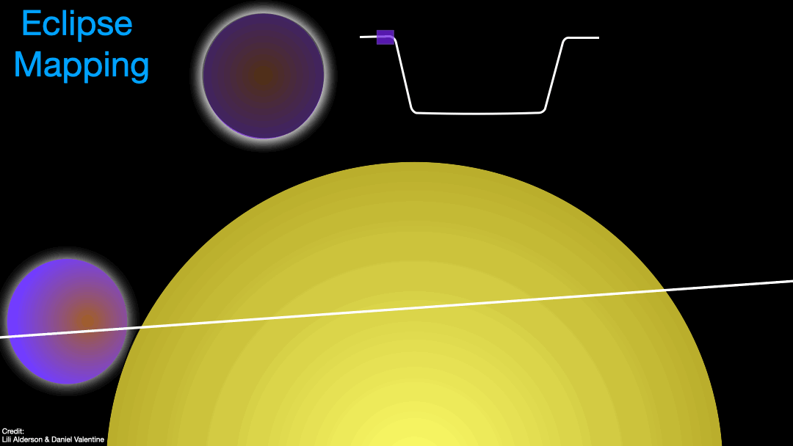



CV
======
I work on characterising exoplanet atmospheres using the transit method. In particular, I use secondary eclipse observations, when a transiting exoplanet is eclipsed by its host star, to characterise the daysides of these exotic worlds. I do this using two primary methods:

Emission Spectroscopy
======

Transiting exoplanets on short orbits are tidally locked to their host stars, and therefore have a permanent dayside and nightside. Just prior to secondary eclipse, the dayside of the exoplanet is facing us, and so we observe the combined light of both the planet and the star. During secondary eclipse, we only observe the light from the star; subtracting the latter from the former therefore isolates the light of the planet. By performing these measurements spectroscopically, we can examine how the planet's light changes as a function of wavelength.

For a planet with no atmosphere, the spectrum would (mostly) follow a blackbody. If there is an atmosphere present, however, then we will observe deviations from this blackbody shape due to atmospheric attenuation. At short wavelengths, we observe in reflected light - starlight reflected by the planetary atmosphere. This can be used to diagnose the presence, spatial distribution, and species of clouds. At longer wavelengths, we observe thermal emission from the planet itself, and can use these measurements to diagnose the atmospheric chemistry by observing the absorption/emission features of different chemical species, with the size of these features telling us how abundant those species are in the atmosphere. Since different wavelengths probe different altitudes of the atmosphere, these measurement can also be used to characterise the vertical temperature profile.

Eclipse Mapping
======

Traditionally, exoplanet atmospheres have been treated as 1D due to limitations with data quality. For dayside eclipse observations, this meant that we took the combined star-planet light measured either side of eclipse, and the isolated stellar light measured during eclipse, and simply differenced them in order to produce an emission measurement that is averaged over the entire dayside hemisphere. We know from both data and theory, however, that exoplanet atmospheres are dynamic, complex environments that can exhibit significant horizontal and vertical gradients in temperature, chemsitry, and dynamics. Thus, multidimensional characterisation is needed in order to truly understand these worlds. With the advent of JWST, with its unprecedented data quality, such multidimensional characterisation is now feasible. There are numerous multidimensional characterisation techniques, including transmission, eclipse, and phase curve mapping, eahc providing a unique view into the multidimensionality of exoplanet atmospheres. I primarily focus on eclipse mapping.

Eclipse mapping takes the secondary eclipse measurement used in emission spectroscopy one step further in order to unlock the full 3D (longitude-latitude-pressure) profile of exoplanet atmospheres. Instead of treating the eclipse as an instantaneous event wherein the entire dayside hemisphere is obscured, eclipse mapping utilises the high-cadence, high-precision data of JWST in order to track the partial eclipse of the exoplanet during ingress/egress, and uses these measurements to reconstruct a resolved map of the dayside flux profile. During eclipse ingress, the dayside of the planet is gradually occulted by the star, corresponding to gradual flux decreases in the light curve until the planet is fully eclipsed. The inverse is also true during egress as the planet is revealed from behind the star. With high-cadence data, these partial eclipse phases during ingress/egress are well sampled, wherein the star is essentially observed to be obscuring/revealing successive "slices" of the dayside profile. The change in flux between successive measurements can be measured with high-precision data, and be attributed to these slices. Hence, by differencing successive measurements, the flux of each slice can be isolated. This enables slice profiles of the dayside atmosphere to be derived from both ingress and egress. The eclipse geometry of ingress is approximately inverse to that of egress, resulting in oppositely oriented slice profiles. Combining these complementary profile therefore results in a grid which slices over both the longitudes and latitudes of the dayside hemisphere, within which the flux of each cell is measurable, enabling the construction of a 2D map of the dayside thermal profile. Performing this mapping technique as a function of pressure with spectroscopic observations further extends the profile to 3D. Eclipse maps therefore offer us revolutionary insight into the multidimensional processes at play in exoplanet atmospheres, including the global climate, weather patterns, resultant shaping of the thermal profile, and chemical species distribution. 

[//]: # (By exploiting the geometry of eclipse with high-cadence observations, eclipse mapping can therefore additionally measure the latitudinal profile, and overall constrain smaller-scale structure than is possible with phase mapping. However, eclipse mapping requires higher quality data than phase mapping, and can only map the dayside.)

[//]: # (**How Eclipse Mapping Works:**)

